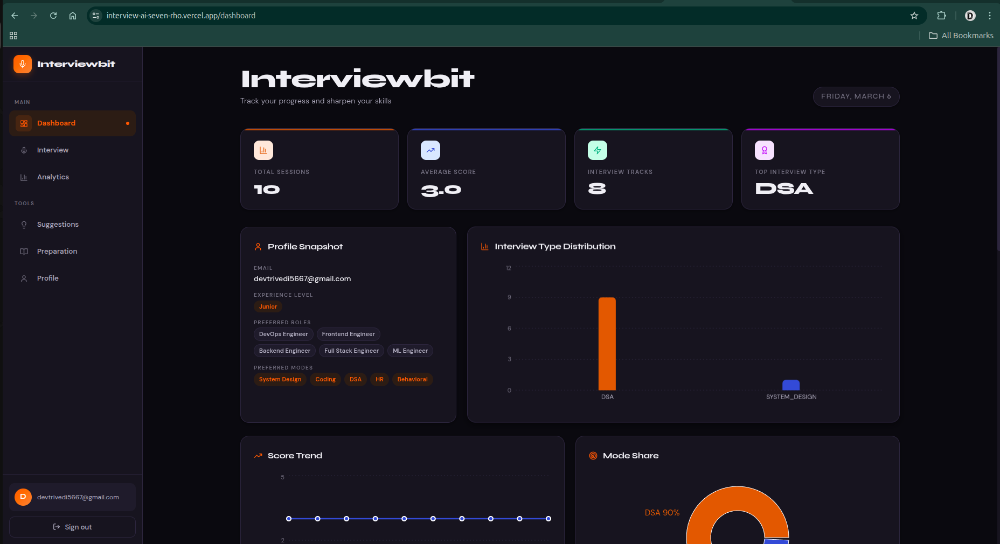
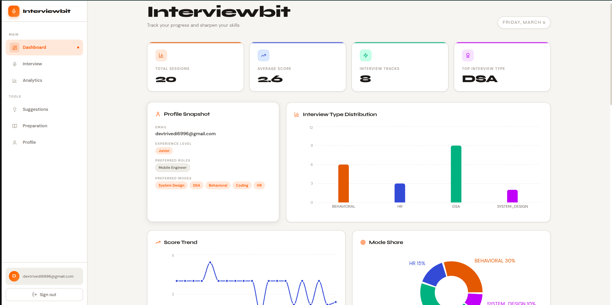
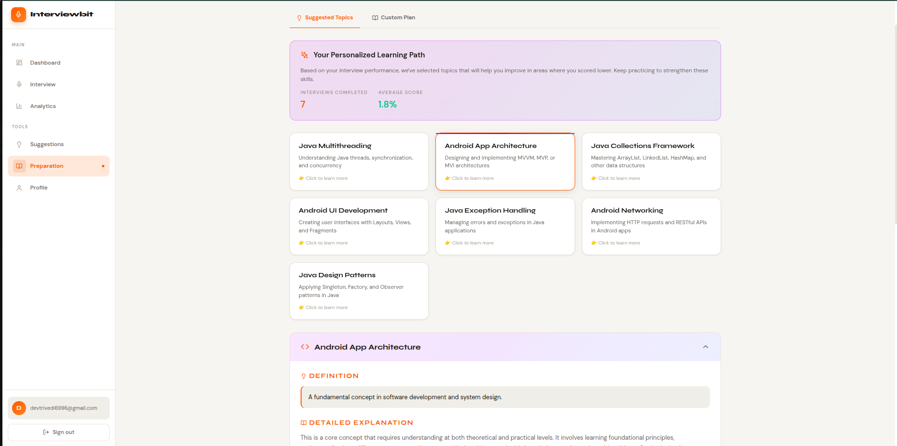
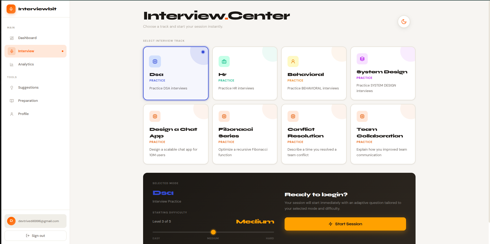
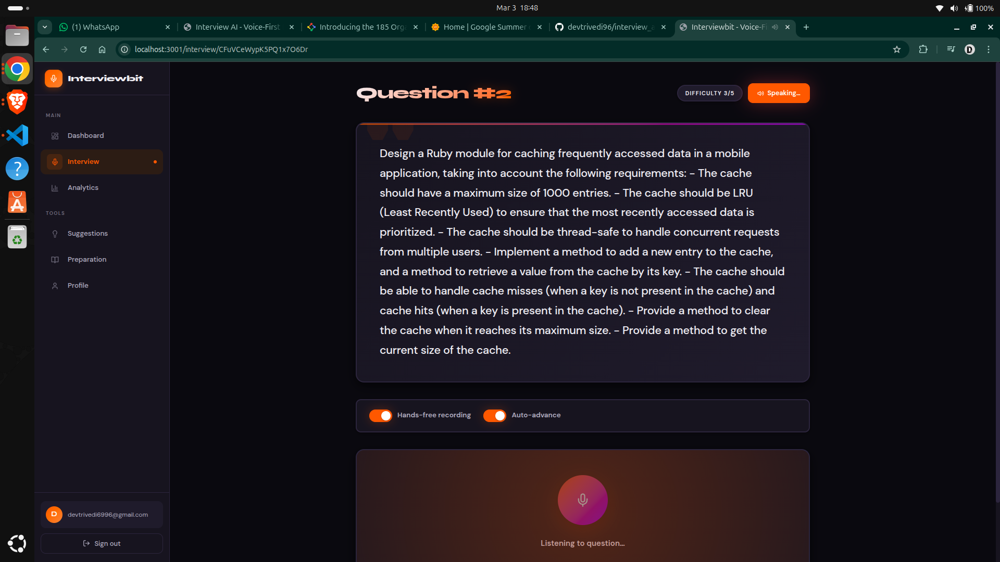
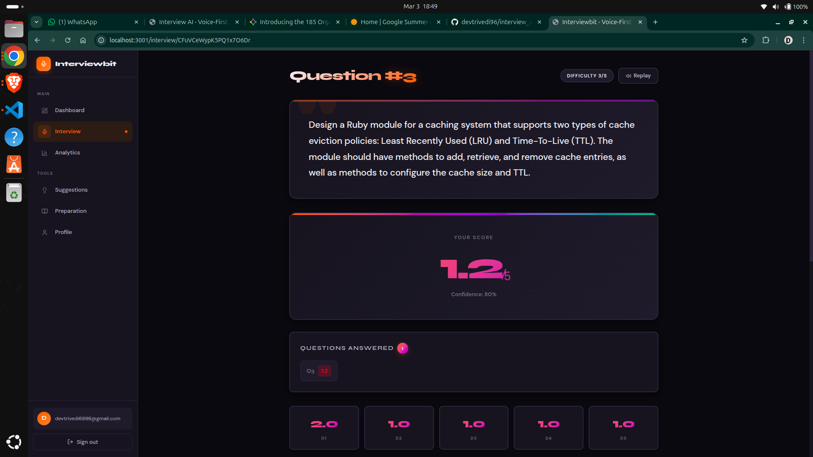
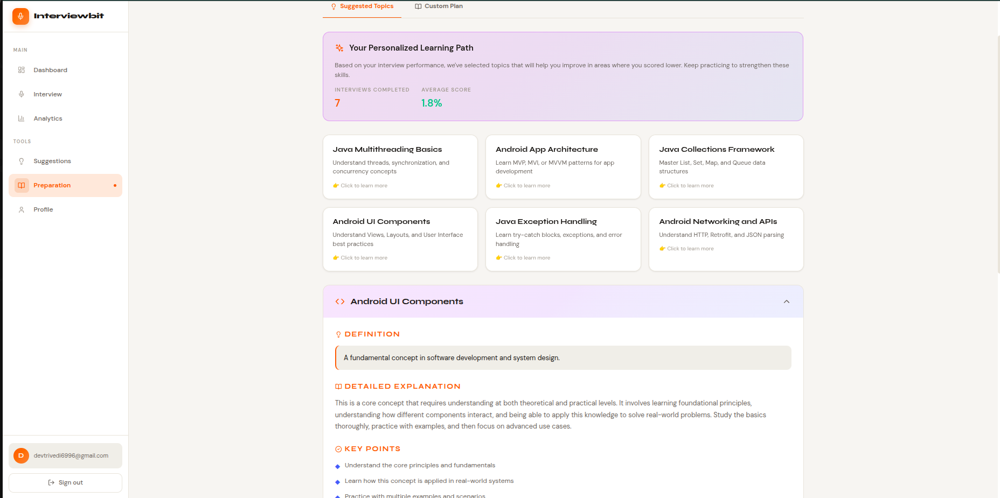
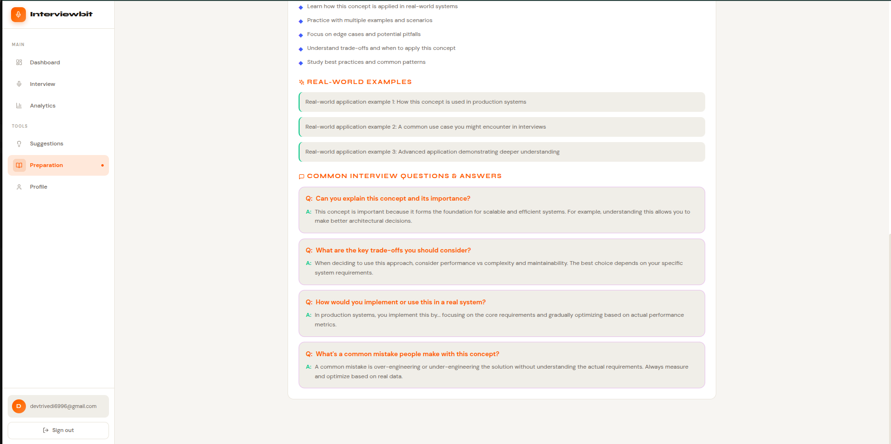
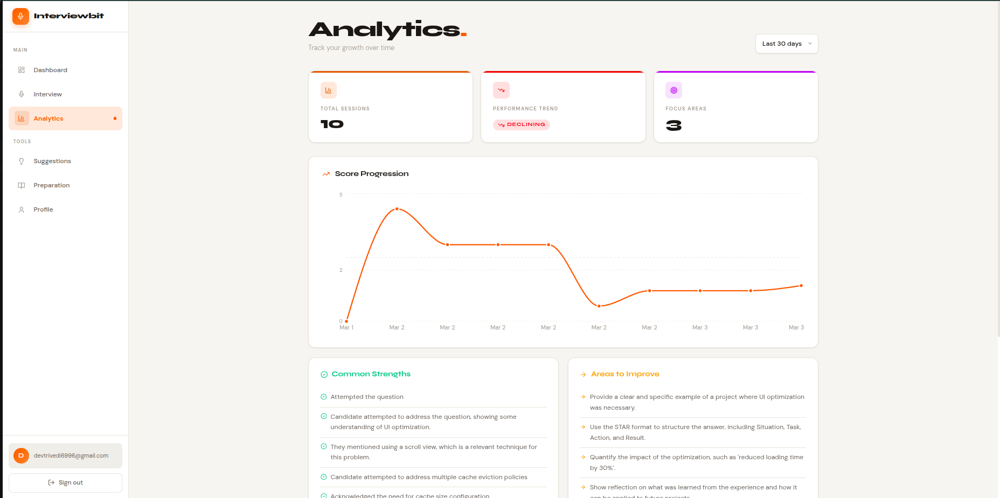

# Frontend Documentation

## Overview

The frontend is a React + Vite single-page application that provides the complete interview-practice experience: onboarding, preparation, interview execution, feedback, and analytics.

## Tech Stack

- React + React Router
- Zustand for client-side auth/profile state
- Tailwind CSS + custom theme variables
- Axios-based service layer for API integration

## Frontend Routes

Core routes defined in `client/src/App.jsx`:

- `/` Home
- `/login`, `/register`
- `/dashboard`
- `/preparation`
- `/interview` (Interview Center)
- `/interview/:sessionId` (Live Interview)
- `/session/:sessionId/summary`
- `/session/:sessionId/qa-summary`
- `/analytics`
- `/profile`
- `/suggestions`

## Main UI Features

### Dashboard
Central hub for progress, recent activity, and navigation shortcuts.





### Preparation
Pre-interview preparation content and readiness support.



### Interview Center
Session setup and interview mode selection before starting.



### Live Interview
Question-by-question answering experience with voice/text flow.



### Evaluation and Feedback
Rubric-based answer scoring with detailed feedback.







### Analytics
Performance trends, insights, and progress tracking.



## Frontend User Pipeline

1. User logs in and lands on Dashboard.
2. User opens Preparation to review recommended material.
3. User starts a session from Interview Center.
4. Live Interview page drives question-answer flow.
5. Session summary and QA feedback views show evaluation details.
6. Analytics page tracks long-term improvement.

## API Integration Points

Frontend services call backend APIs in these domains:

- Session lifecycle: create/start/answer/next/complete
- Analytics: progress and insights
- Profile and preferences
- Authentication and consent

## Local Run

```bash
cd client
npm install
npm run dev
```
