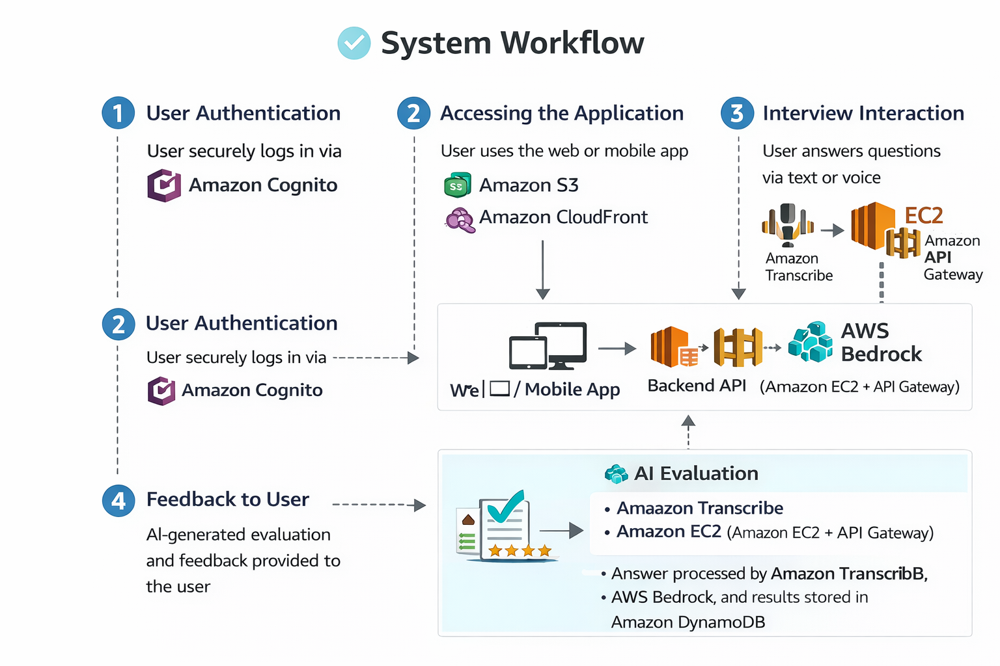

# Interviewbit Platform

AI-powered interview practice platform for realistic mock interviews, voice-based answering, and structured AI feedback.

## Component Documentation

- [Frontend Documentation](FRONTEND.md)
- [Backend Documentation](BACKEND.md)

## Project Overview

Interviewbit helps candidates practice interview rounds in a guided flow, get immediate rubric-based feedback, and track progress over time. The platform combines a React frontend, FastAPI backend, AI evaluation services, and analytics to simulate an end-to-end interview experience.

## Main Features Offered

- Adaptive interview flow with one-question-at-a-time progression
- Voice and text answer support
- AI-generated evaluation with strengths and improvement areas
- Session summaries and per-question detailed feedback
- Preparation and suggestion views before interviews
- Analytics dashboard for tracking performance trends

## Interview Pipeline

### 1. Preparation
Users begin by selecting interview mode/preferences and preparing for the target role.


### 2. Interview Center
The interview setup screen organizes session start options and interview configuration.


### 3. Live Interview Session
Candidates answer generated questions (voice/text) in a structured session flow.


### 4. Evaluation
After submission, AI evaluates responses using rubric-based criteria.


### 5. Detailed Explanation
The platform provides detailed explanation-level feedback for each answer.


### 6. Strengths from the Interview
Users receive highlighted strengths from the completed interview.


### 7. Dashboard and Analytics
Performance summaries and trends are visualized in dashboard and analytics views.


## System Workflow

High-level workflow of the overall platform:



## Architecture

- Frontend: React + Vite + Zustand + Tailwind
- Backend: FastAPI with modular routes and interview state engine
- Data Layer: DynamoDB access abstraction (Firestore-compatible structure in code)
- AI Services: AWS Bedrock for question/evaluation assistance + STT adapter
- Deployment: GitHub Actions pipeline to S3 + CloudFront for frontend delivery

## API Surface (Main)

- `POST /api/v1/sessions` create session
- `POST /api/v1/sessions/{session_id}/start` generate first question
- `POST /api/v1/sessions/{session_id}/questions/{question_id}/answer` submit answer
- `POST /api/v1/sessions/{session_id}/complete` complete interview
- `GET /api/v1/sessions` list user sessions
- `GET /api/v1/analytics/*` performance insights

## Local Run

### Backend

```bash
cd server
pip install -r requirements.txt
uvicorn src.main:app --reload --port 8000
```

### Frontend

```bash
cd client
npm install
npm run dev
```
